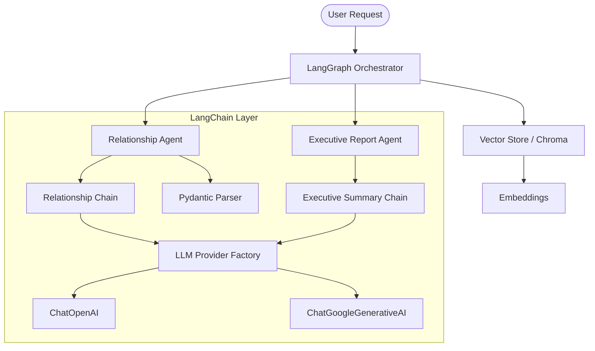

# LangChain Architecture for Supply Chain Intelligence

This document outlines the integration of LangChain components within the Supply Chain Intelligence platform, while preserving the core LangGraph workflow.

## 1. LangGraph Workflow
The system orchestrates a multi-agent workflow using **LangGraph**. The workflow includes:
- **Discovery**: Identifying potential suppliers.
- **Relationship Classification**: Semantic analysis of company relationships.
- **Verification**: Cross-referencing data for authenticity.
- **Risk Assessment**: Identifying financial, news-based, and geopolitical risks.
- **Executive Reporting**: Generating business-ready summaries.

## 2. LangChain Components

### LLM Abstraction Layer (`providers/llm_provider.py`)
A centralized factory for chat models. It abstracts the underlying provider (OpenAI or Gemini), allowing the system to switch models easily.
- `get_llm(provider="openai")` -> Returns `ChatOpenAI`
- `get_llm(provider="gemini")` -> Returns `ChatGoogleGenerativeAI`

### Prompt Templates (`prompts/`)
All LLM prompts are externalized into reusable templates.
- `relationship_prompt.py`: Template for classifying company relationships.
- `executive_report_prompt.py`: Template for generating executive summaries.

### Structured Output Parsing
Agents use LangChain's `PydanticOutputParser` and `JsonOutputParser` to ensure LLMs return validated, structured data instead of raw text.

### Chains (`chains/`)
Complex logic is encapsulated in LangChain Expression Language (LCEL) chains:
- **Relationship Chain**: Composed of the relationship prompt, LLM, and Pydantic parser.
- **Executive Summary Chain**: Composed of the summary prompt, LLM, and string output parser.

### Retrieval Layer (`retrieval/vector_store.py`)
A vector-based retrieval system using **ChromaDB**.
- **Embeddings**: `OpenAIEmbeddings` or `GoogleGenerativeAIEmbeddings`.
- **Functionality**: Indexes supplier profiles, risk assessments, and executive reports for semantic search.
- `index_analysis(state)`: Persists results into the vector store.
- `search_analysis(query)`: Retrieves relevant analysis snippets based on queries.

### Tool Abstraction (`tools/`)
Functional components are exposed as LangChain Tools, enabling future AI Assistant/Chatbot integration.
- `get_supplier_info`: Lookup tool for supplier details.
- `get_risk_info`: Retrieval tool for risk data.
- `get_historical_trends`: Access to historical health data.

### Conversation Memory (`memory/conversation_memory.py`)
Optional `ConversationBufferMemory` support for maintaining context in future interactive sessions.

## 3. Architecture Diagram


## 4. Usage Example
```python
from providers.llm_provider import get_llm
from chains.relationship_chain import get_relationship_chain

# Initialize LLM
llm = get_llm(provider="openai")

# Execute relationship classification
chain = get_relationship_chain(provider="openai")
result = chain.invoke({
    "target_company": "Apple",
    "candidate_entity": "TSMC",
    "evidence": "TSMC is a primary chip manufacturer for Apple products.",
    "format_instructions": parser.get_format_instructions()
})
```
